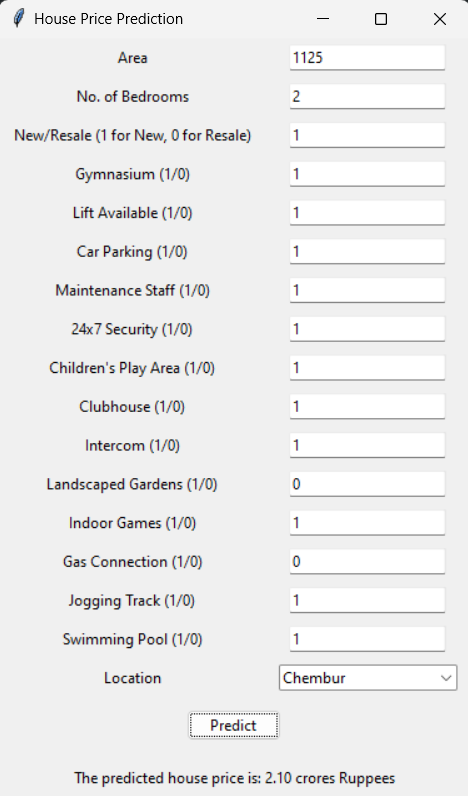

# House-Price-Prediction-Model
This a simple machine learning project that I had made for house price prediction using linear regression, my next step is to apply feature engineering and improve the interpretability of the dataset, while also testing the results by applying different models like random forest, polynomial regression etc

## Current Features:
- Used sci-kit learn to use linear regression model
- Tkinter for building the UI

## Preview:
